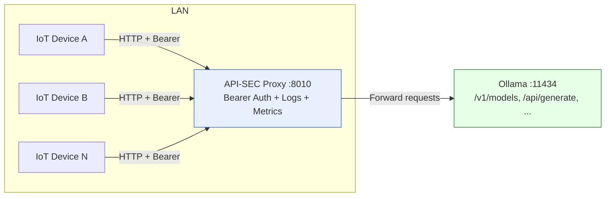

# API Proxy Server - Componente Servidor

Servidor proxy implementado con FastAPI para capturar y procesar solicitudes HTTP.

## Estructura del Proyecto

```
.
├── .env                    # Variables de entorno
├── requirements.txt        # Dependencias Python
├── run_server.py          # Script de inicio
├── src/
│   ├── __init__.py
│   ├── config/
│   │   ├── __init__.py
│   │   └── settings.py    # Configuración con Pydantic
│   └── server/
│       ├── __init__.py
│       ├── app.py         # Aplicación FastAPI principal
│       ├── middleware.py  # Middleware para logging
│       └── routes.py      # Rutas del proxy
```

## Instalación

1. Crear y activar un entorno virtual (recomendado):
```bash
python -m venv venv
source venv/bin/activate
```

2. Instalar las dependencias:
```bash
pip install -r requirements.txt
```

3. Configurar las variables de entorno en el archivo `.env`:
```
IP_BIND=0.0.0.0
PORT_BIND=8000
IP_LISTENER=127.0.0.1
PORT_LISTENER=11434
API_KEY=0480469fba14b87ad14588f6a4877ac19dfb9986be342a88a4535f7b631a753ecdcf003ed8ea61adcf51a30619fd2a664a2aa45037eb801646011a52b32ef761
```

## Ejecución

### Método 1: Usando el script de inicio
```bash
python run_server.py
```

### Método 2: Ejecución directa
```bash
python -m src.server.app
```

### Método 3: Usando uvicorn directamente
```bash
uvicorn src.server.app:app --host 0.0.0.0 --port 8000 --reload
```

## Endpoints

### Endpoints de información
- `GET /` - Información básica del servidor
- `GET /health` - Health check del servidor
- `GET /info` - Información detallada del servidor

### Endpoint proxy
- `ALL METHODS /{path:path}` - Captura todas las solicitudes HTTP

## Características

- ✅ Captura todos los métodos HTTP (GET, POST, PUT, DELETE, PATCH, OPTIONS, HEAD)
- ✅ Preserva todos los headers, query parameters y body de las solicitudes
- ✅ Middleware para logging básico y avanzado
- ✅ Configuración mediante variables de entorno
- ✅ Manejo de errores y excepciones
- ✅ CORS habilitado
- ✅ Estructura modular y extensible

## Logging

El servidor implementa dos niveles de middleware para logging:

1. **LoggingMiddleware**: Registra información básica de solicitudes y respuestas
2. **RequestDataMiddleware**: Captura y registra detalles adicionales como query parameters y body

## Desarrollo

## Instalar como servicio systemd

Requisitos: tener el entorno virtual creado y las dependencias instaladas.


Aviso sobre .env:
- Este servicio carga variables desde el archivo `.env` en la raíz del proyecto (EnvironmentFile).
- Para comenzar, crea tu configuración a partir del ejemplo:
```bash
cp .env.example .env
```
- Edita al menos: `IP_BIND`, `PORT_BIND`, `IP_LISTENER`, `PORT_LISTENER`, `API_KEY`, `LOG_LEVEL`.
- Cada vez que modifiques `.env`, reinicia el servicio para aplicar cambios:
```bash
sudo systemctl restart api-sec
```
- Mantén secretos fuera del repositorio (no subas `.env` a control de versiones).

Comandos principales:
```bash
sudo scripts/install_systemd_service.sh api-sec
sudo systemctl status api-sec
journalctl -u api-sec -f
sudo systemctl restart api-sec
sudo systemctl enable api-sec
sudo systemctl disable api-sec
```

Desinstalar el servicio:
```bash
sudo systemctl disable --now api-sec
sudo rm /etc/systemd/system/api-sec.service
sudo systemctl daemon-reload
```

Nota: asegúrate de que el script sea ejecutable (permisos recomendados 755):
```bash
chmod 755 scripts/install_systemd_service.sh
```


## Pruebas rápidas con curl

Validación rápida de autenticación y reenvío:

- Solicitud válida (token correcto):
```bash
curl -X POST http://localhost:8010/api/generate \
  -H "Content-Type: application/json" \
  -H "Authorization: Bearer YOUR_API_KEY" \
  -d '{"model":"gpt-oss:20b","prompt":"Hello"}'
```

- Solicitud inválida (token erróneo):
```bash
curl -X POST http://localhost:8010/api/generate \
  -H "Content-Type: application/json" \
  -H "Authorization: Bearer WRONG_TOKEN" \
  -d '{"model":"gpt-oss:20b","prompt":"Hello"}'
# Esperado: 401 {"error":"Invalid authentication token"}
```

Notas:
- El endpoint de destino puede responder en modo streaming (múltiples líneas JSON).
- Sustituye YOUR_API_KEY por el valor real configurado en tu `.env`.

### Ejemplo estilo chatbot (streaming)

Permite obtener texto continuo como en un chat usando el endpoint de generación con stream:

```bash
export TOKEN=YOUR_API_KEY
curl -sN http://localhost:8010/api/generate \
  -H "Authorization: Bearer $TOKEN" \
  -H "Content-Type: application/json" \
  -d '{"model":"gpt-oss:20b","prompt":"System: Eres un asistente útil y conciso.\nUser: Hola, ¿qué puedes hacer?\nAssistant:","stream":true}' \
| jq -r 'select(.response!=null) | .response'
```

Notas:
- Reemplaza YOUR_API_KEY por el valor real configurado en tu `.env`.
- El filtro de `jq` muestra solo el campo `response` en tiempo real; si quieres ver todo el JSON, elimina el filtro.

## Caso de uso: Hogar + IoT + Ollama (proxy seguro)

### Objetivo
Usar este proxy para exponer, de forma segura dentro de la red local, un servidor Ollama (modelos locales o acceso a proveedores tipo cloud vía gateway) y permitir que dispositivos IoT consuman IA multimodal sin hardware potente. El proxy agrega autenticación Bearer y observabilidad.

### Arquitectura (resumen)
- Dispositivos IoT en LAN → Proxy API-SEC (puerto 8010, autenticación Bearer) → Ollama (11434) u otro backend de IA.
- El proxy valida tokens, registra métricas/logs y reenvía rutas como “drop-in” (/v1/models, /api/generate, etc.).

### Diagrama (Mermaid)


### Requisitos
- Un host dentro de tu red con:
  - Ollama instalado (u otro backend de IA)
  - Este proxy ejecutándose (systemd recomendado)
- Un token compartido (API_KEY) para los dispositivos IoT

### Configuración de ejemplo (.env)
```ini
IP_BIND=0.0.0.0
PORT_BIND=8010
IP_LISTENER=192.168.1.43
PORT_LISTENER=11434
API_KEY=coloca-un-token-largo-y-seguro
```

### Flujo típico
1) El dispositivo IoT hace una petición a `http://IP_DEL_PROXY:8010/...` con `Authorization: Bearer <TOKEN>`.
2) El proxy valida el token y reenvía la solicitud al backend (Ollama).
3) La respuesta (incluyendo streaming) vuelve al dispositivo IoT.

### Ejemplos rápidos
- Consultar modelos disponibles del backend:
```bash
export TOKEN=YOUR_API_KEY
curl -s http://192.168.1.50:8010/v1/models \
  -H "Authorization: Bearer $TOKEN" | jq
```

- Generación estilo “chatbot” con streaming:
```bash
export TOKEN=YOUR_API_KEY
curl -sN http://192.168.1.50:8010/api/generate \
  -H "Authorization: Bearer $TOKEN" \
  -H "Content-Type: application/json" \
  -d '{"model":"gpt-oss:20b","prompt":"System: ...\nUser: ...\nAssistant:","stream":true}'
```

### Buenas prácticas de seguridad
- Mantener el proxy solo en la LAN (no exponer 8010 a Internet).
- Rotar periódicamente `API_KEY` y distribuirla de forma segura en los IoT.
- Opcional: colocar delante un reverse proxy TLS (Caddy/Traefik/Nginx) si necesitas HTTPS interno.
- Limitar por firewall qué IPs pueden alcanzar el puerto 8010.


Para modo de desarrollo con recarga automática:
```bash
uvicorn src.server.app:app --host 0.0.0.0 --port 8000 --reload --log-level debug
```

